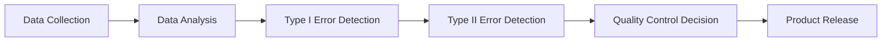

## Introduction
Hello and welcome to this technical deep dive into Type I and Type II errors, a crucial aspect of statistical hypothesis testing that has significant implications for machine learning engineers, AI developers, and technical decision-makers. In recent years, the rapid deployment of AI and ML models into production environments has led to a surge in the number of false positives and false negatives, resulting in costly mistakes and compromised decision-making. The primary culprit behind these issues is the lack of understanding and mismanagement of Type I and Type II errors. In this blog post, we will delve into the world of statistical hypothesis testing, exploring the concepts, implications, and practical applications of Type I and Type II errors. By the end of this article, readers will have a solid grasp of these fundamental concepts and be equipped to design and deploy more robust and reliable ML systems.

The traditional approach to statistical hypothesis testing has often focused on minimizing Type I errors, also known as false positives, at the expense of Type II errors, or false negatives. However, this narrow focus has led to a plethora of problems, including overfitting, underfitting, and poor model generalization. The consequences of these mistakes can be severe, ranging from financial losses to compromised safety and security. Therefore, it is essential to understand the intricacies of Type I and Type II errors and develop strategies to mitigate their impact.

## Core Concepts
At the heart of statistical hypothesis testing lies the concept of null and alternative hypotheses. The null hypothesis represents the default assumption, while the alternative hypothesis represents the hypothesis that we want to test. Type I errors occur when we reject the null hypothesis when it is actually true, resulting in a false positive. On the other hand, Type II errors occur when we fail to reject the null hypothesis when it is actually false, resulting in a false negative. The probability of Type I errors is typically denoted by the Greek letter alpha (α), while the probability of Type II errors is denoted by beta (β).

The following table summarizes the key concepts related to Type I and Type II errors:

| Concept | Description | Probability |
| --- | --- | --- |
| Type I Error | False Positive | α |
| Type II Error | False Negative | β |
| Power | 1 - β | 1 - β |
| Significance Level | α | α |

To illustrate the concept, let's consider a simple example. Suppose we want to test the hypothesis that a new medication is effective in treating a particular disease. The null hypothesis would be that the medication has no effect, while the alternative hypothesis would be that the medication is effective. If we reject the null hypothesis when it is actually true, we would be committing a Type I error, resulting in a false positive. On the other hand, if we fail to reject the null hypothesis when it is actually false, we would be committing a Type II error, resulting in a false negative.

## Technical Walkthrough
To demonstrate the practical application of Type I and Type II errors, let's consider a simple example using Python. Suppose we want to test the hypothesis that a new algorithm is more accurate than an existing one. We can use the following code to simulate the hypothesis testing process:
```python
import numpy as np
from scipy import stats

# Define the null and alternative hypotheses
null_hypothesis = "The new algorithm is not more accurate than the existing one"
alternative_hypothesis = "The new algorithm is more accurate than the existing one"

# Define the significance level (α)
alpha = 0.05

# Generate synthetic data
np.random.seed(0)
data = np.random.normal(0, 1, 100)

# Calculate the test statistic
test_statistic = np.mean(data)

# Calculate the p-value
p_value = stats.ttest_1samp(data, 0).pvalue

# Reject the null hypothesis if the p-value is less than α
if p_value < alpha:
    print("Reject the null hypothesis: The new algorithm is more accurate than the existing one")
else:
    print("Fail to reject the null hypothesis: The new algorithm is not more accurate than the existing one")
```
In this example, we define the null and alternative hypotheses, set the significance level (α), generate synthetic data, calculate the test statistic, and calculate the p-value. We then reject the null hypothesis if the p-value is less than α, indicating that the new algorithm is more accurate than the existing one.

## Real-World Applications
Type I and Type II errors have significant implications in a wide range of real-world applications, including:

1. **Medical Diagnosis**: In medical diagnosis, Type I errors can result in false positives, leading to unnecessary treatments and potential harm to patients. On the other hand, Type II errors can result in false negatives, leading to delayed or missed diagnoses.
2. **Financial Forecasting**: In financial forecasting, Type I errors can result in false alarms, leading to unnecessary portfolio adjustments and potential financial losses. On the other hand, Type II errors can result in missed opportunities, leading to potential financial gains.
3. **Quality Control**: In quality control, Type I errors can result in false positives, leading to unnecessary rework and potential delays. On the other hand, Type II errors can result in false negatives, leading to defective products and potential safety hazards.

The following architecture diagram illustrates the application of Type I and Type II errors in a quality control system:

In this diagram, we collect data, analyze it, detect Type I errors, detect Type II errors, make quality control decisions, and release the product.

## Production Considerations
When deploying ML models into production environments, it is essential to consider the potential bottlenecks, edge cases, and failure modes. Some of the key production considerations include:

1. **Monitoring**: Monitoring the performance of ML models in production is crucial to detect potential issues and prevent errors.
2. **Evaluation Drift**: Evaluation drift occurs when the distribution of the data changes over time, leading to potential errors and decreased model performance.
3. **Scaling Concerns**: Scaling ML models to handle large volumes of data and traffic can be challenging, requiring careful consideration of hardware and software resources.

To mitigate these concerns, we can use optimization strategies such as:

1. **Regular Model Updates**: Regularly updating ML models to reflect changes in the data distribution and prevent evaluation drift.
2. **Model Ensemble**: Using model ensembles to combine the predictions of multiple models and improve overall performance.
3. **Load Balancing**: Using load balancing techniques to distribute traffic and prevent scaling concerns.

## Conclusion
In conclusion, Type I and Type II errors are fundamental concepts in statistical hypothesis testing that have significant implications for machine learning engineers, AI developers, and technical decision-makers. By understanding the concepts, implications, and practical applications of Type I and Type II errors, we can design and deploy more robust and reliable ML systems. As the field of AI and ML continues to evolve, it is essential to stay up-to-date with the latest research and developments in statistical hypothesis testing and to apply these concepts in real-world applications. By doing so, we can unlock the full potential of AI and ML and create more accurate, reliable, and trustworthy systems.